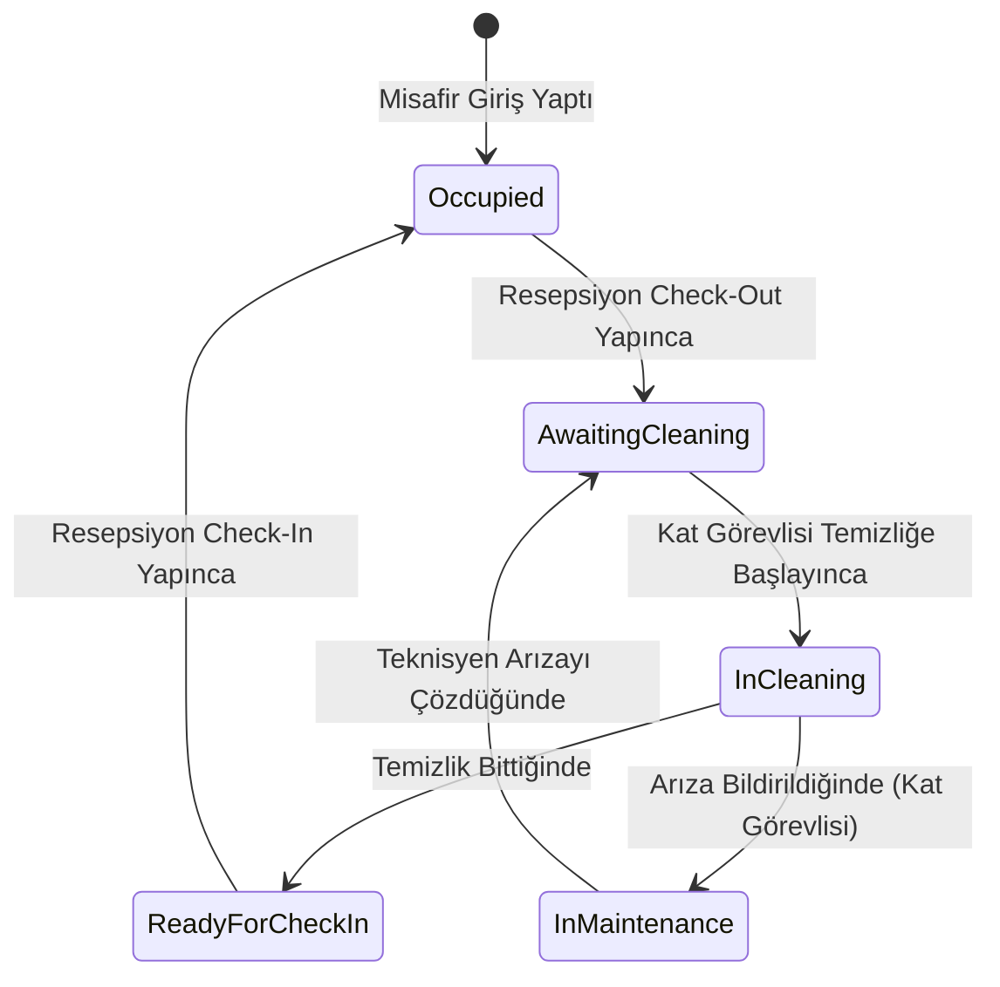

# 🏨 DHotel - Dağıtık Otel Oda Yaşam Döngüsü Yönetim Sistemi

[](https://dotnet.microsoft.com/)
[](https://masstransit.io/)
[](https://www.rabbitmq.com/)
[](https://react.dev/)
[](https://www.docker.com/)
[](https://microsoft.github.io/reverse-proxy/)

**DHotel**, mikroservis mimarisi, Event-Driven Architecture (EDA) ve Saga State Machine orkestrasyon ilkeleri ile geliştirilmiş enterprise seviyede bir otel operasyon ve oda yaşam döngüsü yönetim sistemidir.

---

## 📌 Mimari Özellikler

- **🔀 Gateway & SignalR WebSockets (YARP):** Tüm mikroservislere tek giriş noktası (`http://localhost:5000`) ve tüm tarayıcılara anlık durum yayınlayan SignalR Hub.
- **🔄 Saga State Machine Orkestrasyonu (MassTransit + EF Core):** Odaların tüm yaşam döngüsünü (Check-Out ➔ Temizlik ➔ Bakım ➔ Check-In ➔ Dolu) MariaDB `SagaDb` üzerinde tutarlı yöneten state machine.
- **🛡️ Transactional Outbox / Inbox Pattern:** Veritabanı işlemleri ve mesajlaşmayı atomik yapan, ağ kesintilerinde mesaj kaybını önleyen idempotent yapı.
- **📦 Hibrit Veritabanı Mimarisi:** 
  - **MariaDB (SQL):** IdentityDb, FrontDeskDb, MaintenanceDb, SagaDb
  - **MongoDB (NoSQL):** HousekeepingDb
- **⚡ İyimser Arayüz Güncellemesi (Optimistic UI):** Kullanıcı tıklamalarında 0ms anında görsel tepki veren, arka planda asenkron mikroservis haberleşmesi sağlanan React arayüzü.

---

## 🗂️ Mikroservis ve Port Haritası

| Servis | Açıklama | Veritabanı / Teknolojiler | Yerel Port |
| :--- | :--- | :--- | :--- |
| **`Yarp.Gateway`** | API Gateway & SignalR Hub | YARP, SignalR WebSockets | `http://localhost:5000` |
| **`Identity.API`** | Kimlik Doğrulama Servisi | MariaDB, JWT Auth | `http://localhost:5001` |
| **`FrontDesk.API`** | Resepsiyon & Check-In/Out | MariaDB, Outbox Pattern | `http://localhost:5002` |
| **`Housekeeping.API`** | Temizlik Görev Yönetimi | MongoDB, MassTransit | `http://localhost:5003` |
| **`Maintenance.API`** | Teknik Servis & Arıza Kayıt | MariaDB, Outbox Pattern | `http://localhost:5004` |
| **`RoomLifecycle.Saga`** | Saga State Machine Orkestratörü | MariaDB (SagaDb), Minimal API | `http://localhost:5005` |
| **`dhotel-ui`** | Modern React Arayüzü | React, Vite, Zustand, SignalR | `http://localhost:5173` |

---

## 🔄 Otel Oda Döngüsü (Circular Lifecycle)



---

## 🛠️ Ön Gereksinimler

Sistemi lokal ortamınızda çalıştırmak için bilgisayarınızda kurulu olması gerekenler:

- [**.NET 9.0 SDK**](https://dotnet.microsoft.com/download/dotnet/9.0)
- [**Node.js (v18 veya üzeri)**](https://nodejs.org/)
- [**Docker Desktop**](https://www.docker.com/products/docker-desktop/) (Veritabanları ve RabbitMQ için)

---

## 🚀 Hızlı Kurulum ve Çalıştırma

### 1️⃣ Konteynerleri Başlatma (RabbitMQ, MariaDB, MongoDB, Seq, Jaeger)

Ana proje dizininde bir terminal açarak Docker konteynerlerini ayağa kaldırın:

```bash
docker compose up -d
```

---

### 2️⃣ Tüm Backend Mikroservislerini Çalıştırma

**PowerShell** terminalinde aşağıdaki **tek satırlık betiği** çalıştırarak 6 mikroservisi aynı anda başlatabilirsiniz:

```powershell
Start-Process dotnet -ArgumentList "run --project src/ApiGateways/Yarp.Gateway"
Start-Process dotnet -ArgumentList "run --project src/Services/Identity.API"
Start-Process dotnet -ArgumentList "run --project src/Services/FrontDesk.API"
Start-Process dotnet -ArgumentList "run --project src/Services/Housekeeping.API"
Start-Process dotnet -ArgumentList "run --project src/Services/Maintenance.API"
Start-Process dotnet -ArgumentList "run --project src/Orchestrator/RoomLifecycle.Saga"
```

---

### 3️⃣ Frontend Uygulamasını Çalıştırma

Yeni bir terminal penceresinde frontend dizinine gidin ve Vite dev sunucusunu başlatın:

```bash
cd src/Web/dhotel-ui
npm install
npm run dev
```

Arayüz varsayılan olarak **`http://localhost:5173`** adresinde açılacaktır! 🎨

---

## 📊 İzleme ve Yönetim Panelleri (Monitoring)

Sistem çalışırken aşağıdaki paneller üzerinden canlı izleme yapabilirsiniz:

- 🌐 **Otel Operasyon Arayüzü:** `http://localhost:5173`
- 🐇 **RabbitMQ Dashboard:** `http://localhost:15672` *(Kullanıcı: `guest` | Şifre: `guest`)*
- 📜 **Seq Merkezi Loglama:** `http://localhost:5341`
- 🔍 **Jaeger Dağıtık İzleme (Tracing):** `http://localhost:16686`

---

## 🧪 Dağıtık Dayanıklılık (Resilience) Testi

1. **Çevrimdışı Kuyruklama (Offline Queueing):**
   - Terminalden `Maintenance.API` servisini kapatın (`Ctrl + C`).
   - Ekranda 5 adet arıza bildirimi yapın.
   - `http://localhost:15672/#/queues/%2F/create-maintenance-ticket-queue` adresine gidin. Mesajların kaybolmadığını, **5 adet bekleyen** mesaj olduğunu ve kuyruk grafiğinde tepe noktası (spike) oluştuğunu görün.
   - `Maintenance.API` servisini tekrar çalıştırdığınızda mesajların tüketilip MariaDB'ye kazar kazar işlendiğini izleyin.

2. **F5 / Çapraz Tarayıcı Kalıcılığı (Dual Persistence):**
   - Chrome tarayıcısında bir odanın temizliğini başlatın.
   - Edge tarayıcısında `http://localhost:5173` adresini açın; Edge anında MariaDB `SagaDb` veritabanına bağlanarak canlı durumu çeker ve iki tarayıcı da SignalR üzerinden eş zamanlı güncellenir.

---

## 📄 Lisans

Bu proje eğitim ve kurumsal gösterim amaçlı geliştirilmiştir. Tüm MassTransit ve .NET bileşenleri açık kaynaklı standartlara uygundur.
